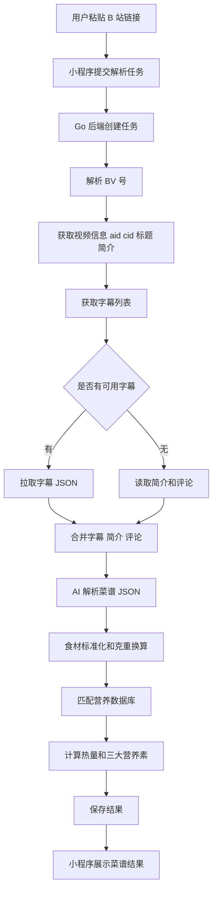

### **PRD：B 站做菜视频 AI 菜谱解析小程序 V1.0**

#### **文档信息**

| 项目 | 内容 |
|---|---|
| 产品名称 | AI 菜谱解析助手 |
| 版本 | V1.0 |
| 文档日期 | 2026-05-29 |
| 前端 | 微信小程序 |
| 后端 | Go |
| V1 核心能力 | 根据 B 站字幕、简介、置顶评论、高赞评论解析做菜步骤、材料和热量 |
| 暂不支持 | 视频下载、音频转文字、画面识别、批量解析、多平台解析 |

---

## **一、产品背景**

很多用户在 B 站看做菜视频时，会遇到几个问题：视频节奏快、材料用量散落在不同片段、步骤需要反复拖动进度条查看、热量和营养信息基本没有。对于想学做菜、控卡、健身、减脂或记录饮食的人来说，视频内容不够结构化。

本产品希望解决这个问题：用户只需要粘贴一个 B 站做菜视频链接，小程序自动获取视频字幕、简介和评论中的菜谱信息，使用 AI 拆解成结构化菜谱，并计算整道菜和每份的热量、蛋白质、脂肪、碳水等信息。

V1 不做视频下载和音频识别，只基于已有文本内容解析，优先使用字幕，其次使用视频简介、置顶评论和高赞评论。

---

## **二、产品目标**

### **2.1 核心目标**

V1 的目标是验证“从 B 站做菜视频自动生成菜谱和热量分析”这个需求是否成立。产品要做到用户粘贴链接后，在较短时间内得到一份可读、可编辑、可参考的菜谱卡片。

核心结果包括：

1. 识别菜名。
2. 提取材料清单。
3. 提取做菜步骤。
4. 标注步骤来源，例如字幕、简介、置顶评论。
5. 估算材料克重。
6. 计算总热量和每份热量。
7. 展示蛋白质、脂肪、碳水。
8. 允许用户修改材料克重并重新计算热量。

### **2.2 非目标**

V1 不解决以下问题：

1. 不解析视频画面。
2. 不下载视频。
3. 不提取音频。
4. 不做 ASR 语音转文字。
5. 不支持抖音、小红书、YouTube 等其他平台。
6. 不支持批量解析多个视频。
7. 不保证所有 B 站视频都能解析成功。
8. 不提供医疗、减脂诊断或健康治疗建议。

---

## **三、目标用户**

### **3.1 核心用户**

第一类用户是普通做饭学习者。他们在 B 站看到一道菜，想快速知道材料和步骤，不想来回拖动视频。

第二类用户是控卡用户。他们关心一份菜大概多少热量，尤其关注油、肉、糖、主食等高热量来源。

第三类用户是健身和减脂用户。他们不仅关心热量，也关心蛋白质、脂肪、碳水的比例。

第四类用户是内容整理型用户。他们习惯把视频菜谱整理成文字版，保存或分享。

---

## **四、用户场景**

### **4.1 场景一：用户看到 B 站做菜视频，想快速整理菜谱**

用户在 B 站看到“番茄牛腩”的视频，复制链接，打开微信小程序，粘贴链接，点击“开始解析”。系统读取字幕和简介后，生成材料和步骤。

用户最终看到：

```text
菜名：番茄牛腩
材料：牛腩 500g、番茄 300g、洋葱 100g、生抽 30ml
步骤：
1. 牛腩冷水下锅焯水
2. 番茄炒出汁
3. 加牛腩炖煮
4. 收汁调味
```

### **4.2 场景二：用户想知道这道菜热量高不高**

用户解析完“红烧肉”视频后，系统显示：

```text
整道菜约 2380 kcal
每份约 595 kcal
主要热量来源：五花肉、食用油、冰糖
```

用户发现系统估算“食用油 20g”，但自己实际只放了 10g，于是修改用量，热量自动重新计算。

### **4.3 场景三：视频没有字幕，但简介或置顶评论有配方**

某些 B 站视频没有字幕，但 UP 主在简介或置顶评论写了材料表。系统发现无字幕后，自动使用简介和评论解析。

小程序提示：

```text
未找到可用字幕，已使用视频简介和评论解析，结果可能不完整。
```

---

## **五、产品范围**

### **5.1 V1 支持内容来源**

| 来源 | 是否支持 | 说明 |
|---|---:|---|
| B 站字幕 | 支持 | 优先级最高 |
| 视频简介 | 支持 | 用于补充材料、配方比例 |
| 置顶评论 | 支持 | 用于补充文字版菜谱 |
| 高赞评论 | 支持 | 只取少量，辅助解析 |
| 普通评论大量抓取 | 不支持 | V1 不做评论分析产品 |
| 音频转文字 | 不支持 | V1 不做 ASR |
| 视频画面识别 | 不支持 | V1 不做视觉识别 |

### **5.2 V1 支持视频类型**

优先支持：

1. 单 P 做菜视频。
2. 有中文字幕或 AI 字幕的视频。
3. 简介中包含材料、用量、步骤的视频。
4. 评论区有文字版菜谱的视频。

暂不优先支持：

1. 多 P 系列视频。
2. 没有字幕、简介和菜谱评论的视频。
3. 直播回放。
4. 需要付费或特殊权限观看的视频。
5. 非做菜类视频。

---

## **六、核心业务流程**



---

## **七、功能需求**

## **7.1 首页：提交 B 站链接**

### **功能说明**

用户在首页输入或粘贴 B 站视频链接，点击按钮后创建解析任务。

### **页面元素**

| 元素 | 类型 | 说明 |
|---|---|---|
| 标题 | 文本 | AI 菜谱解析助手 |
| 链接输入框 | 输入框 | 支持粘贴 B 站视频链接 |
| 开始解析按钮 | 按钮 | 提交任务 |
| 使用说明 | 文本 | 提醒用户目前支持 B 站做菜视频 |
| 历史记录入口 | 按钮 | V1 可选，若开发时间紧可放到 V1.1 |

### **输入示例**

```text
https://www.bilibili.com/video/BVxxxx
```

### **前端校验**

提交前需要做基础校验：

1. 输入不能为空。
2. 必须包含 `bilibili.com`、`b23.tv` 或 `BV`。
3. 如果无法识别，提示“请输入有效的 B 站视频链接”。

### **交互逻辑**

用户点击“开始解析”后：

1. 按钮进入 loading 状态。
2. 小程序请求后端创建任务。
3. 创建成功后跳转任务进度页。
4. 创建失败则显示错误提示。

### **异常提示**

| 场景 | 提示 |
|---|---|
| 链接为空 | 请先粘贴 B 站视频链接 |
| 链接格式错误 | 暂未识别到有效的 B 站视频链接 |
| 网络错误 | 网络异常，请稍后重试 |
| 后端错误 | 任务创建失败，请稍后再试 |

---

## **7.2 任务进度页**

### **功能说明**

用户提交链接后进入任务进度页。小程序定时轮询后端任务状态，展示当前解析进度。

### **任务状态**

| 状态 | 含义 | 前端表现 |
|---|---|---|
| pending | 任务已创建 | 显示准备解析 |
| processing | 正在处理 | 显示当前步骤 |
| done | 解析完成 | 自动跳转结果页 |
| failed | 解析失败 | 显示失败原因和返回按钮 |

### **进度文案**

后端返回的 `message` 可以是：

```text
正在解析视频链接
正在获取视频信息
正在获取字幕
未找到字幕，正在读取简介和评论
正在整理文本内容
正在用 AI 拆解菜谱
正在计算热量
正在生成结果
解析完成
```

### **轮询规则**

小程序每 2 秒查询一次任务状态。最长轮询时间建议为 60 秒。如果超过 60 秒仍未完成，提示：

```text
解析时间较长，请稍后在历史记录中查看结果。
```

V1 如果不做历史记录，则提示：

```text
解析时间较长，请稍后重新尝试。
```

---

## **7.3 结果页：菜谱展示**

### **功能说明**

结果页展示 AI 解析出的菜谱，包括菜名、材料、步骤、热量和数据来源。

### **页面结构**

结果页建议分为 6 个区域：

1. 视频信息区。
2. 解析状态说明区。
3. 材料清单区。
4. 做菜步骤区。
5. 热量分析区。
6. 不确定信息提示区。

### **视频信息区**

展示字段：

| 字段 | 说明 |
|---|---|
| 视频标题 | B 站视频标题 |
| UP 主 | 视频作者 |
| 视频来源 | B 站 |
| 数据来源 | 字幕 / 简介 / 评论 |
| 解析时间 | 当前解析时间 |

示例：

```text
视频：番茄牛腩这样做太下饭了
UP 主：家常菜小厨房
数据来源：字幕、视频简介、置顶评论
```

### **解析状态说明区**

如果有字幕：

```text
已根据视频字幕、简介和评论生成菜谱。
```

如果没有字幕：

```text
未找到可用字幕，已根据视频简介和评论生成菜谱，结果可能不完整。
```

如果部分材料为估算：

```text
部分材料用量为 AI 估算，请根据实际烹饪情况调整。
```

---

## **7.4 材料清单**

### **功能说明**

展示 AI 提取出的材料、估算克重、来源和置信度。

### **字段**

| 字段 | 说明 |
|---|---|
| 材料名 | 例如牛腩、番茄、生抽 |
| 原始用量 | 例如一斤、两个、两勺 |
| 标准克重 | 例如 500g、300g、30ml |
| 来源 | 字幕、简介、置顶评论、高赞评论 |
| 置信度 | 高、中、低 |

### **展示示例**

```text
牛腩
原始用量：一斤
标准用量：500g
来源：字幕
置信度：高

番茄
原始用量：两个
标准用量：300g
来源：视频简介
置信度：中

食用油
原始用量：少许
标准用量：10g
来源：字幕
置信度：低
```

### **置信度规则**

| 置信度 | 条件 |
|---|---|
| 高 | 原文明确出现克、斤、毫升、勺等用量 |
| 中 | 原文出现“两个”“半个”“一把”等可估算表达 |
| 低 | 原文只出现“适量”“少许”或由 AI 推断 |

---

## **7.5 做菜步骤**

### **功能说明**

展示 AI 拆解的做菜步骤。若来源为字幕，则尽量显示时间点。

### **字段**

| 字段 | 说明 |
|---|---|
| 步骤序号 | 从 1 开始 |
| 步骤标题 | 例如牛腩焯水 |
| 步骤说明 | 详细做法 |
| 时间点 | 字幕来源时显示 |
| 技法 | 焯水、爆香、炖煮、收汁等 |
| 来源 | 字幕、简介、评论 |

### **展示示例**

```text
1. 牛腩焯水
时间：00:12 - 00:45
说明：牛腩切块，冷水下锅，加入姜片和料酒焯水。
技法：焯水
来源：字幕

2. 炒番茄
时间：01:20 - 01:50
说明：锅中加少量油，放入番茄炒出汁。
技法：翻炒
来源：字幕
```

---

## **7.6 热量分析**

### **功能说明**

系统根据材料克重和营养数据库计算整道菜和每份的热量、蛋白质、脂肪、碳水。

### **展示内容**

| 字段 | 说明 |
|---|---|
| 总热量 | 整道菜估算热量 |
| 每份热量 | 总热量除以份数 |
| 蛋白质 | 总蛋白质和每份蛋白质 |
| 脂肪 | 总脂肪和每份脂肪 |
| 碳水 | 总碳水和每份碳水 |

### **展示示例**

```text
整道菜约 1593 kcal
每份约 796 kcal

蛋白质：96g
脂肪：112g
碳水：35g

主要热量来源：
1. 牛腩：1415 kcal
2. 食用油：133 kcal
3. 番茄：45 kcal
```

### **计算公式**

单个材料热量：

$$
食材热量 = \frac{食材克重}{100} \times 每100克热量
$$

整道菜热量：

$$
总热量 = \sum 食材热量
$$

每份热量：

$$
每份热量 = \frac{总热量}{份数}
$$

---

## **7.7 修改材料并重新计算**

### **功能说明**

用户可以修改材料克重或份数，系统实时重新计算热量。

### **入口**

结果页材料清单区域提供“修改用量”按钮。

### **可修改字段**

| 字段 | 是否可修改 |
|---|---:|
| 材料名称 | V1 可不支持 |
| 克重 | 支持 |
| 份数 | 支持 |
| 是否计入热量 | 支持，V1 可选 |

### **示例**

用户将：

```text
食用油 20g
```

改为：

```text
食用油 10g
```

系统重新计算热量并刷新结果。

### **交互要求**

1. 修改后点击“重新计算”。
2. 后端返回新的营养结果。
3. 前端只刷新热量区域，不需要重新 AI 解析。
4. 用户修改后的结果应覆盖当前页面展示。

---

## **八、AI 解析规则**

### **8.1 输入内容结构**

后端传给 AI 的文本需要统一组织为：

```text
【视频标题】
番茄牛腩这样做太下饭了

【视频简介】
牛腩一斤，番茄两个，洋葱半个，生抽两勺。

【字幕文本】
[12.30-15.40] 今天我们做番茄牛腩
[15.50-21.00] 牛腩先冷水下锅，加姜片和料酒焯水

【置顶评论】
文字版菜谱：牛腩一斤，番茄两个，炖 40 分钟。

【高赞评论】
番茄多炒一会儿更出汁。
```

### **8.2 来源优先级**

AI 解析时使用以下优先级：

```text
字幕 > 视频简介 > 置顶评论 > 高赞评论
```

如果不同来源冲突，优先使用字幕和视频简介。如果评论内容只是用户评价，不应当被识别为原始菜谱步骤。

### **8.3 AI 输出 JSON 格式**

```json
{
  "dish_name": "番茄牛腩",
  "servings": 2,
  "ingredients": [
    {
      "name": "牛腩",
      "amount": 1,
      "unit": "斤",
      "grams": 500,
      "confidence": 0.95,
      "source": "subtitle",
      "source_text": "准备牛腩一斤"
    }
  ],
  "steps": [
    {
      "order": 1,
      "title": "牛腩焯水",
      "description": "牛腩切块，冷水下锅，加入姜片和料酒焯水。",
      "start_time": 12.3,
      "end_time": 45.2,
      "techniques": ["焯水"],
      "duration_minutes": 5,
      "source": "subtitle"
    }
  ],
  "tips": ["番茄需要炒出汁后再炖"],
  "uncertain_items": ["食用油用量为少许，按 10g 估算"],
  "confidence": 0.86
}
```

### **8.4 AI 解析约束**

AI 必须遵守以下规则：

1. 只能基于字幕、简介和评论解析，不得编造关键材料。
2. 评论里出现的用户建议不能直接当作原视频步骤。
3. “适量”“少许”必须降低置信度。
4. “一勺”“两个”“一把”需要换算成克或毫升。
5. 如果无法判断菜名，可以从视频标题推断，但置信度降低。
6. 如果无法判断份数，默认按 1 份，并标记不确定。
7. 如果无法提取有效材料和步骤，返回解析失败。

---

## **九、后端接口设计**

## **9.1 创建解析任务**

```text
POST /api/v1/analyze/bilibili
```

### **请求参数**

```json
{
  "url": "https://www.bilibili.com/video/BVxxxx"
}
```

### **成功响应**

```json
{
  "task_id": "task_202605291145480001",
  "status": "pending"
}
```

### **失败响应**

```json
{
  "code": "INVALID_URL",
  "message": "请输入有效的 B 站视频链接"
}
```

---

## **9.2 查询任务状态**

```text
GET /api/v1/tasks/{task_id}
```

### **处理中响应**

```json
{
  "task_id": "task_202605291145480001",
  "status": "processing",
  "message": "正在获取字幕",
  "recipe_id": null
}
```

### **完成响应**

```json
{
  "task_id": "task_202605291145480001",
  "status": "done",
  "message": "解析完成",
  "recipe_id": 10086
}
```

### **失败响应**

```json
{
  "task_id": "task_202605291145480001",
  "status": "failed",
  "message": "没有找到字幕、简介或可用评论",
  "recipe_id": null
}
```

---

## **9.3 获取菜谱结果**

```text
GET /api/v1/recipes/{recipe_id}
```

### **响应示例**

```json
{
  "video": {
    "bvid": "BVxxxx",
    "title": "番茄牛腩这样做太下饭了",
    "owner_name": "家常菜小厨房"
  },
  "text_sources": {
    "has_subtitle": true,
    "has_description": true,
    "comment_count": 2
  },
  "recipe": {
    "dish_name": "番茄牛腩",
    "servings": 2,
    "ingredients": [
      {
        "name": "牛腩",
        "amount": 1,
        "unit": "斤",
        "grams": 500,
        "confidence": 0.95,
        "source": "subtitle",
        "source_text": "牛腩一斤"
      }
    ],
    "steps": []
  },
  "nutrition": {
    "total_kcal": 1593,
    "kcal_per_serving": 796,
    "total_protein": 96,
    "total_fat": 112,
    "total_carbs": 35,
    "details": []
  }
}
```

---

## **9.4 重新计算热量**

```text
POST /api/v1/recipes/{recipe_id}/recalculate
```

### **请求参数**

```json
{
  "servings": 2,
  "ingredients": [
    {
      "name": "牛腩",
      "grams": 500
    },
    {
      "name": "番茄",
      "grams": 300
    },
    {
      "name": "食用油",
      "grams": 10
    }
  ]
}
```

### **响应参数**

```json
{
  "nutrition": {
    "total_kcal": 1504,
    "kcal_per_serving": 752,
    "total_protein": 96,
    "total_fat": 102,
    "total_carbs": 35,
    "details": []
  }
}
```

---

## **十、后端处理逻辑**

### **10.1 Go 服务流程**

Go 后端分为 API 服务和 Worker 服务。

API 服务负责：

1. 接收小程序请求。
2. 创建任务。
3. 返回任务 ID。
4. 查询任务状态。
5. 返回菜谱结果。
6. 接收重新计算请求。

Worker 服务负责：

1. 解析 B 站链接。
2. 获取视频信息。
3. 获取字幕。
4. 获取简介和评论。
5. 合并文本来源。
6. 调用 AI。
7. 计算热量。
8. 保存结果。

### **10.2 任务处理流程**

```text
创建任务
    ↓
解析 BV 号
    ↓
获取 aid / cid / title / desc
    ↓
尝试获取字幕
    ↓
获取简介和评论
    ↓
合并文本
    ↓
AI 解析
    ↓
JSON 校验
    ↓
营养计算
    ↓
保存结果
    ↓
任务完成
```

### **10.3 字幕获取逻辑**

优先使用第 1P 的 `cid`。V1 默认只解析第 1P。

字幕选择优先级：

```text
中文人工字幕 > 中文 AI 字幕 > 其他中文字幕 > 第一条可用字幕
```

如果字幕为空，进入简介和评论解析逻辑。

### **10.4 评论获取逻辑**

V1 只获取少量评论：

1. 置顶评论。
2. 前几条高赞评论。
3. 包含菜谱关键词的评论。

菜谱关键词包括：

```text
食材、材料、配方、步骤、做法、克、g、勺、分钟、焯水、腌、爆香、小火、大火、生抽、老抽、蚝油
```

不抓取大量评论，不做翻页抓取，避免把产品变成评论采集工具。

---

## **十一、数据结构设计**

### **11.1 任务表**

```sql
CREATE TABLE analyze_tasks (
  id BIGSERIAL PRIMARY KEY,
  task_id VARCHAR(64) UNIQUE NOT NULL,
  status VARCHAR(32) NOT NULL,
  message TEXT,
  recipe_id BIGINT,
  error_message TEXT,
  created_at TIMESTAMP DEFAULT NOW(),
  updated_at TIMESTAMP DEFAULT NOW()
);
```

### **11.2 视频表**

```sql
CREATE TABLE bilibili_videos (
  id BIGSERIAL PRIMARY KEY,
  bvid VARCHAR(64) UNIQUE,
  aid BIGINT,
  cid BIGINT,
  title TEXT,
  description TEXT,
  owner_name VARCHAR(255),
  created_at TIMESTAMP DEFAULT NOW()
);
```

### **11.3 文本来源表**

```sql
CREATE TABLE video_text_sources (
  id BIGSERIAL PRIMARY KEY,
  video_id BIGINT REFERENCES bilibili_videos(id),
  source_type VARCHAR(32),
  content TEXT,
  raw_json JSONB,
  created_at TIMESTAMP DEFAULT NOW()
);
```

`source_type` 取值：

```text
subtitle
description
top_comment
hot_comment
```

### **11.4 菜谱表**

```sql
CREATE TABLE recipes (
  id BIGSERIAL PRIMARY KEY,
  video_id BIGINT REFERENCES bilibili_videos(id),
  dish_name VARCHAR(255),
  servings INT,
  recipe_json JSONB NOT NULL,
  confidence NUMERIC(4, 3),
  created_at TIMESTAMP DEFAULT NOW(),
  updated_at TIMESTAMP DEFAULT NOW()
);
```

### **11.5 营养食材表**

```sql
CREATE TABLE nutrition_foods (
  id BIGSERIAL PRIMARY KEY,
  canonical_name VARCHAR(255) NOT NULL,
  aliases JSONB,
  kcal_per_100g NUMERIC(10, 2),
  protein_per_100g NUMERIC(10, 2),
  fat_per_100g NUMERIC(10, 2),
  carbs_per_100g NUMERIC(10, 2),
  source VARCHAR(128),
  created_at TIMESTAMP DEFAULT NOW()
);
```

### **11.6 营养结果表**

```sql
CREATE TABLE recipe_nutrition_results (
  id BIGSERIAL PRIMARY KEY,
  recipe_id BIGINT REFERENCES recipes(id),
  total_kcal NUMERIC(10, 2),
  kcal_per_serving NUMERIC(10, 2),
  result_json JSONB NOT NULL,
  created_at TIMESTAMP DEFAULT NOW()
);
```

---

## **十二、营养数据库要求**

### **12.1 V1 必须内置高频食材**

V1 不需要一开始覆盖所有食材，但必须覆盖中餐高频材料。

优先内置：

```text
猪肉、五花肉、瘦肉、牛肉、牛腩、鸡胸肉、鸡腿、鸡蛋、虾仁、豆腐、土豆、番茄、洋葱、胡萝卜、青椒、白菜、米饭、面条、食用油、盐、白糖、生抽、老抽、蚝油、料酒、淀粉、黄油、奶油、芝士
```

### **12.2 食材匹配规则**

食材匹配分为三层：

1. 精确匹配，例如“牛腩”匹配“牛腩”。
2. 别名匹配，例如“西红柿”匹配“番茄”。
3. 模糊匹配，例如“牛肉块”匹配“牛肉”。

如果无法匹配：

1. 不计入总热量。
2. 在结果中标记“未匹配营养数据”。
3. 提示用户手动选择或忽略。

---

## **十三、小程序页面需求**

### **13.1 页面列表**

```text
pages/index/index
pages/task/task
pages/result/result
pages/edit-ingredients/edit-ingredients
```

### **13.2 首页**

核心功能：

1. 粘贴链接。
2. 提交解析。
3. 显示使用说明。

### **13.3 任务页**

核心功能：

1. 显示任务状态。
2. 轮询后端状态。
3. 完成后跳转结果页。
4. 失败后展示原因。

### **13.4 结果页**

核心功能：

1. 展示视频信息。
2. 展示材料。
3. 展示步骤。
4. 展示热量。
5. 展示不确定项。
6. 提供“修改用量”入口。

### **13.5 修改用量页**

核心功能：

1. 修改材料克重。
2. 修改份数。
3. 提交重新计算。
4. 返回结果页刷新热量。

---

## **十四、异常和边界情况**

| 异常场景 | 处理方式 |
|---|---|
| 链接无法识别 | 提示用户输入有效 B 站链接 |
| 短链无法展开 | 提示链接解析失败 |
| 视频信息获取失败 | 提示视频信息获取失败 |
| 没有字幕 | 使用简介和评论解析 |
| 没有简介和评论 | 提示没有找到可用菜谱文本 |
| AI 输出 JSON 错误 | 后端尝试修复一次，失败则返回解析失败 |
| 材料没有用量 | 估算并标记低置信度 |
| 食材匹配不到营养数据 | 标记未匹配，不计入总热量 |
| 任务超时 | 标记 failed，提示稍后重试 |
| 多 P 视频 | V1 默认解析第 1P |
| 非做菜视频 | AI 判断无法提取菜谱，返回失败 |

---

## **十五、埋点与数据指标**

### **15.1 核心指标**

| 指标 | 说明 |
|---|---|
| 提交任务数 | 用户提交解析的次数 |
| 解析成功率 | 成功生成菜谱的比例 |
| 字幕命中率 | 成功获取字幕的比例 |
| 评论兜底成功率 | 无字幕时通过简介/评论成功解析的比例 |
| 平均解析耗时 | 从提交到完成的时间 |
| 用户修改率 | 用户修改材料克重的比例 |
| 重新计算次数 | 用户重新计算热量的次数 |

### **15.2 关键事件**

```text
submit_bilibili_url
create_task_success
create_task_failed
subtitle_found
subtitle_not_found
comment_fallback_used
ai_parse_success
ai_parse_failed
nutrition_calculate_success
nutrition_calculate_failed
ingredient_edit_clicked
nutrition_recalculate_success
```

---

## **十六、验收标准**

### **16.1 功能验收**

V1 上线前至少满足：

1. 用户可以粘贴 B 站链接并创建解析任务。
2. 后端可以解析 BV 号。
3. 后端可以获取视频标题、简介、aid、cid。
4. 后端可以尝试获取字幕。
5. 后端可以在无字幕时读取简介和少量评论。
6. AI 可以输出结构化菜谱 JSON。
7. 后端可以校验 AI 返回的 JSON。
8. 系统可以计算热量和三大营养素。
9. 小程序可以展示材料、步骤和热量。
10. 用户可以修改材料克重并重新计算热量。

### **16.2 效果验收**

准备 30 个 B 站做菜视频作为测试集：

| 测试类型 | 数量 | 目标 |
|---|---:|---|
| 有字幕视频 | 15 个 | 至少 12 个成功解析 |
| 无字幕但简介有配方 | 5 个 | 至少 4 个成功解析 |
| 无字幕但评论有菜谱 | 5 个 | 至少 3 个成功解析 |
| 非做菜视频 | 5 个 | 至少 4 个正确提示无法解析 |

整体目标：

```text
解析成功率 ≥ 70%
有字幕视频成功率 ≥ 80%
平均解析耗时 ≤ 20 秒
热量计算可编辑率 = 100%
```

---

## **十七、版本规划**

### **V1.0：字幕/简介/评论解析版**

上线内容：

1. B 站链接解析。
2. 字幕提取。
3. 简介和评论兜底。
4. AI 菜谱结构化。
5. 热量计算。
6. 小程序结果展示。
7. 修改用量重新计算。

### **V1.1：体验优化版**

可加入：

1. 历史记录。
2. 分享菜谱卡片。
3. 多 P 视频选择。
4. 食材手动匹配。
5. 收藏菜谱。
6. 解析失败时允许用户手动粘贴字幕。

### **V1.2：准确率优化版**

可加入：

1. 更完整的营养数据库。
2. 更好的单位换算。
3. 常见中餐调料模型。
4. AI 二次校验。
5. 菜谱步骤时间轴跳转。

### **V2.0：视频理解增强版**

可考虑：

1. ASR 语音转文字。
2. 视频画面识别。
3. 多平台支持。
4. 用户上传视频解析。
5. 个性化控卡建议。

---

## **十八、开发排期建议**

### **第 1 周：基础后端和小程序骨架**

后端完成：

1. Go 项目初始化。
2. API 路由搭建。
3. 任务表设计。
4. 创建任务接口。
5. 查询任务接口。
6. 小程序首页和任务页联调。

小程序完成：

1. 首页。
2. 任务页。
3. 基础请求封装。

### **第 2 周：B 站文本获取**

后端完成：

1. BV 号解析。
2. 短链跳转解析。
3. 视频信息获取。
4. 字幕列表获取。
5. 字幕 JSON 拉取。
6. 简介和评论获取。
7. 文本来源合并。

### **第 3 周：AI 解析和营养计算**

后端完成：

1. AI Prompt 设计。
2. AI 调用封装。
3. JSON Schema 校验。
4. 食材标准化。
5. 营养数据库初始化。
6. 热量计算服务。

### **第 4 周：结果页和重新计算**

小程序完成：

1. 结果页。
2. 材料清单。
3. 步骤展示。
4. 热量展示。
5. 修改用量页。

后端完成：

1. 菜谱结果接口。
2. 重新计算接口。
3. 异常处理。
4. 埋点日志。
5. 测试集验证。

---

## **十九、技术实现建议**

### **19.1 后端技术选型**

```text
语言：Go
Web 框架：Gin
数据库：PostgreSQL 或 MySQL
缓存：Redis
任务队列：Asynq
ORM：GORM 或 sqlx
部署：Docker
```

### **19.2 后端服务拆分**

```text
api-service：处理小程序请求
worker-service：处理异步解析任务
```

### **19.3 推荐目录结构**

```text
recipe-ai-backend/
├── cmd/
│   ├── api/
│   │   └── main.go
│   └── worker/
│       └── main.go
├── internal/
│   ├── api/
│   ├── client/
│   │   ├── bilibili_client.go
│   │   └── ai_client.go
│   ├── service/
│   │   ├── bilibili_service.go
│   │   ├── text_source_service.go
│   │   ├── ai_recipe_service.go
│   │   ├── nutrition_service.go
│   │   └── task_service.go
│   ├── model/
│   ├── repository/
│   └── worker/
├── config/
├── migrations/
└── go.mod
```

---

## **二十、产品风险与处理**

### **20.1 字幕接口不稳定**

风险：部分视频没有字幕，或字幕接口返回为空。

处理：

1. 使用简介和评论兜底。
2. 前端提示“未找到字幕，结果可能不完整”。
3. V1.1 支持用户手动粘贴字幕。

### **20.2 评论内容噪声高**

风险：评论多为用户评价，不一定是菜谱。

处理：

1. 只取置顶和少量高赞评论。
2. 用关键词过滤。
3. Prompt 中明确评论只作为补充。
4. 不把普通评价识别为步骤。

### **20.3 热量误差大**

风险：中餐用油、调料、肉类肥瘦比例难以准确判断。

处理：

1. 显示“估算”。
2. 标记低置信度材料。
3. 支持用户修改克重。
4. 显示主要热量来源。

### **20.4 AI 幻觉**

风险：AI 可能补充原文没有的材料或步骤。

处理：

1. Prompt 要求不得编造。
2. 输出 `source_text`。
3. 后端校验材料必须有来源。
4. 前端展示来源，方便用户判断。

---

## **二十一、V1 最终交付物**

V1 交付时应包含：

1. 微信小程序首页。
2. 微信小程序任务页。
3. 微信小程序结果页。
4. 微信小程序修改用量页。
5. Go API 服务。
6. Go Worker 服务。
7. B 站文本解析模块。
8. AI 菜谱解析模块。
9. 营养计算模块。
10. 数据库表结构。
11. 基础营养食材数据。
12. 30 条测试视频验证结果。
13. 错误日志和任务状态记录。

这个 PRD 的重点是控制 V1 范围：只做“B 站现有文本解析”，先验证用户是否愿意用、解析结果是否有价值，再考虑 ASR 和视频理解。

*内容由 AI 生成仅供参考*