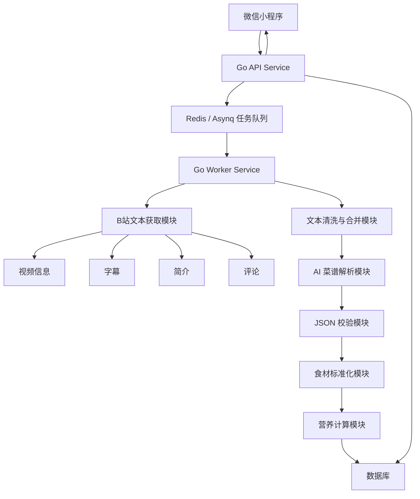
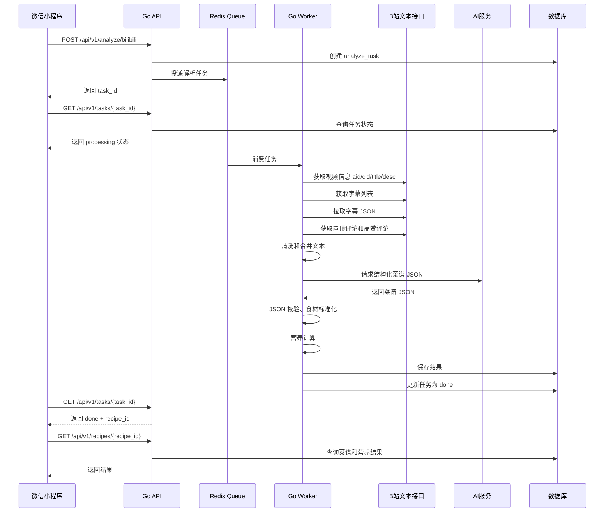
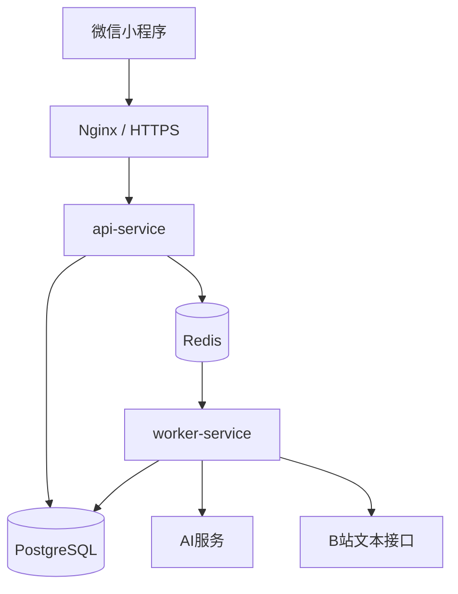

### **技术方案：Go 后端 + 微信小程序，V1 只基于 B 站字幕、简介和评论解析菜谱与热量。**

V1 不做视频下载、ASR 和画面识别，后端只处理公开可访问的文本来源：视频信息、字幕 JSON、简介、置顶评论和少量高赞评论。核心技术链路是：小程序提交链接 → Go 创建异步任务 → 获取 B 站文本 → AI 输出结构化菜谱 JSON → 营养数据库匹配 → 热量计算 → 小程序展示和编辑。

---

## **一、技术目标**

本方案的目标是实现一个可上线验证的 MVP。用户在微信小程序中粘贴 B 站做菜视频链接，后端自动解析该视频已有文本内容，并生成一份结构化菜谱。

V1 的技术边界非常明确：只处理字幕、简介和评论，不处理视频流、音频流和图像帧。这样可以降低实现复杂度、减少计算成本，也更适合微信小程序这种轻量入口。

系统最终输出包括菜名、材料、用量、做菜步骤、步骤来源、材料来源、估算克重、总热量、每份热量、蛋白质、脂肪、碳水，以及不确定项提示。

---

## **二、整体架构**

整体采用“小程序前端 + Go API 服务 + Go Worker 服务 + Redis 队列 + 数据库 + AI 服务 + 营养数据服务”的架构。



服务拆分建议如下：

| 服务 | 技术 | 职责 |
|---|---|---|
| 微信小程序 | 原生小程序 / Taro / uni-app | 提交链接、展示任务状态、展示菜谱和热量 |
| API Service | Go + Gin | 接收请求、创建任务、查询任务、返回结果 |
| Worker Service | Go + Asynq | 异步执行 B 站解析、AI 解析、营养计算 |
| Redis | Redis | 任务队列、任务状态缓存、限流 |
| DB | PostgreSQL / MySQL | 存视频、文本源、菜谱、营养结果 |
| AI Client | Go HTTP Client | 调用大模型生成结构化菜谱 |
| Nutrition Service | Go | 食材匹配、单位换算、热量计算 |

---

## **三、推荐技术选型**

### **3.1 后端技术栈**

| 类型 | 推荐方案 | 说明 |
|---|---|---|
| 语言 | Go | 性能好、部署简单、适合 API 和 Worker |
| Web 框架 | Gin | 生态成熟，上手快 |
| ORM | GORM / sqlx | GORM 开发快，sqlx 更可控 |
| 数据库 | PostgreSQL | JSONB 支持好，适合存 AI 结果 |
| 队列 | Redis + Asynq | Go 生态成熟，适合异步任务 |
| 缓存 | Redis | 任务状态、接口缓存、限流 |
| 配置管理 | Viper / 环境变量 | 方便不同环境部署 |
| 日志 | zap / zerolog | 结构化日志 |
| 部署 | Docker + Nginx | 简单稳定 |
| 监控 | Prometheus + Grafana，可后置 | MVP 可先日志监控 |

如果团队更熟悉 MySQL，也可以使用 MySQL。区别是 PostgreSQL 的 `JSONB` 更适合保存 AI 原始结果、字幕原始 JSON、评论原始 JSON。

### **3.2 小程序技术栈**

如果只做微信小程序，推荐使用原生小程序。页面不复杂，原生开发成本最低。

如果后续可能扩展到 H5 或其他小程序，可以考虑 Taro 或 uni-app。但 MVP 阶段不建议过度抽象。

### **3.3 AI 服务**

AI 服务只需要支持两个能力：

1. 输入长文本，输出严格 JSON。
2. 支持 JSON Schema 或结构化输出约束。

后端要把 AI 结果当成不可信数据处理，必须做 JSON 解析、字段校验、业务校验和异常重试。

---

## **四、核心业务流程**

### **4.1 主流程**



### **4.2 数据来源优先级**

后端要把所有文本来源统一整理成 `TextSourceBundle`，再交给 AI。

优先级如下：

```text
字幕 > 视频简介 > 置顶评论 > 高赞评论
```

具体策略：

| 来源 | 作用 | 可信度 |
|---|---|---|
| 字幕 | 提取步骤、操作顺序、火候、时间 | 高 |
| 视频简介 | 提取材料、用量、配方比例 | 高 |
| 置顶评论 | 补充文字版菜谱 | 中高 |
| 高赞评论 | 补充用户整理的步骤或技巧 | 中 |
| 普通评论 | V1 不做大量获取 | 低 |

---

## **五、系统模块设计**

## **5.1 微信小程序模块**

小程序只负责交互，不承担复杂解析逻辑。

页面建议：

```text
pages/
├── index/
│   └── 首页：输入 B 站链接
├── task/
│   └── 任务页：展示解析进度
├── result/
│   └── 结果页：展示菜谱和热量
└── edit-ingredients/
    └── 修改材料用量
```

首页功能：

1. 输入或粘贴 B 站链接。
2. 前端做基础格式校验。
3. 调用创建任务接口。
4. 成功后跳转任务页。

任务页功能：

1. 每 2 秒轮询任务状态。
2. 展示后端返回的 `message`。
3. 任务完成后跳转结果页。
4. 任务失败后展示失败原因。

结果页功能：

1. 展示视频标题、UP 主、数据来源。
2. 展示材料清单。
3. 展示做菜步骤。
4. 展示总热量、每份热量和三大营养素。
5. 展示不确定项。
6. 提供“修改用量”入口。

修改用量页功能：

1. 修改食材克重。
2. 修改份数。
3. 调用重新计算接口。
4. 返回结果页更新热量。

---

## **5.2 Go API Service**

API Service 负责处理小程序请求，不直接做耗时任务。

核心职责：

1. 创建解析任务。
2. 查询任务状态。
3. 获取菜谱结果。
4. 重新计算热量。
5. 用户鉴权，可 V1.1 再做。
6. 基础限流。
7. 参数校验。

接口列表：

| 方法 | 路径 | 说明 |
|---|---|---|
| POST | `/api/v1/analyze/bilibili` | 创建 B 站解析任务 |
| GET | `/api/v1/tasks/{task_id}` | 查询任务状态 |
| GET | `/api/v1/recipes/{recipe_id}` | 获取菜谱结果 |
| POST | `/api/v1/recipes/{recipe_id}/recalculate` | 修改材料后重新计算热量 |
| GET | `/api/v1/foods/search` | 搜索营养食材，可 V1.1 做 |

---

## **5.3 Go Worker Service**

Worker Service 是核心处理服务。

职责包括：

1. 解析 B 站链接。
2. 处理短链跳转。
3. 获取视频基础信息。
4. 获取字幕列表。
5. 拉取字幕 JSON。
6. 获取简介和少量评论。
7. 清洗文本。
8. 构造 AI 输入。
9. 调用 AI。
10. 校验 AI 输出。
11. 食材标准化。
12. 营养计算。
13. 保存结果。
14. 更新任务状态。

任务状态建议由 Worker 在每个阶段更新：

```text
pending：任务已创建
processing：正在处理
done：解析完成
failed：解析失败
```

处理阶段文案：

```text
正在解析视频链接
正在获取视频信息
正在获取字幕
未找到字幕，正在读取简介和评论
正在整理文本内容
正在用 AI 拆解菜谱
正在校验菜谱结果
正在计算热量
正在保存结果
解析完成
```

---

## **六、后端项目结构**

推荐目录结构如下：

```text
recipe-ai-backend/
├── cmd/
│   ├── api/
│   │   └── main.go
│   └── worker/
│       └── main.go
├── internal/
│   ├── api/
│   │   ├── handler/
│   │   │   ├── analyze_handler.go
│   │   │   ├── task_handler.go
│   │   │   ├── recipe_handler.go
│   │   │   └── nutrition_handler.go
│   │   ├── middleware/
│   │   │   ├── cors.go
│   │   │   ├── recover.go
│   │   │   └── rate_limit.go
│   │   └── router.go
│   ├── client/
│   │   ├── bilibili_client.go
│   │   ├── ai_client.go
│   │   └── http_client.go
│   ├── service/
│   │   ├── analyze_service.go
│   │   ├── bilibili_service.go
│   │   ├── text_source_service.go
│   │   ├── ai_recipe_service.go
│   │   ├── nutrition_service.go
│   │   ├── task_service.go
│   │   └── recipe_service.go
│   ├── repository/
│   │   ├── task_repo.go
│   │   ├── video_repo.go
│   │   ├── text_source_repo.go
│   │   ├── recipe_repo.go
│   │   └── nutrition_repo.go
│   ├── model/
│   │   ├── task.go
│   │   ├── bilibili.go
│   │   ├── recipe.go
│   │   ├── nutrition.go
│   │   └── text_source.go
│   ├── worker/
│   │   ├── analyze_video_worker.go
│   │   └── task_types.go
│   └── pkg/
│       ├── parser/
│       │   └── bilibili_url.go
│       ├── unitconvert/
│       │   └── converter.go
│       ├── validator/
│       │   └── recipe_validator.go
│       └── xjson/
│           └── repair.go
├── migrations/
├── config/
│   └── config.example.yaml
├── scripts/
│   └── seed_nutrition_foods.sql
├── Dockerfile
├── docker-compose.yml
└── go.mod
```

---

## **七、B 站文本获取设计**

### **7.1 输入链接处理**

支持输入类型：

```text
https://www.bilibili.com/video/BVxxxx
https://b23.tv/xxxx
BVxxxx
```

处理逻辑：

1. 如果是 `b23.tv`，先请求跳转后的真实 URL。
2. 从 URL 或文本中提取 `BV` 号。
3. 如果无法提取，返回失败。
4. 后续统一使用 `bvid` 获取视频信息。

Go 示例：

```go
func ParseBVID(input string) (string, error) {
	re := regexp.MustCompile(`BV[a-zA-Z0-9]+`)
	bvid := re.FindString(input)
	if bvid == "" {
		return "", errors.New("未识别到 BV 号")
	}
	return bvid, nil
}
```

短链处理：

```go
func ResolveRedirect(rawURL string) (string, error) {
	client := &http.Client{
		Timeout: 10 * time.Second,
	}

	req, err := http.NewRequest(http.MethodGet, rawURL, nil)
	if err != nil {
		return "", err
	}

	resp, err := client.Do(req)
	if err != nil {
		return "", err
	}
	defer resp.Body.Close()

	return resp.Request.URL.String(), nil
}
```

---

### **7.2 获取视频信息**

获取内容：

```text
aid
bvid
cid
title
desc
owner_name
pages
duration
```

V1 默认只解析第 1P。如果是多 P 视频，在结果中提示“当前仅解析第 1P”。

数据结构：

```go
type VideoInfo struct {
	AID         int64
	BVID        string
	Title       string
	Description string
	OwnerName   string
	Pages       []VideoPage
}

type VideoPage struct {
	CID      int64
	Page     int
	Part     string
	Duration int
}
```

---

### **7.3 获取字幕**

字幕处理流程：

```text
aid + cid
    ↓
获取字幕元信息
    ↓
筛选中文字幕
    ↓
拿到 subtitle_url
    ↓
拉取字幕 JSON
    ↓
转换成 timed_text 和 plain_text
```

字幕结构：

```go
type SubtitleMeta struct {
	ID          int64
	Lan         string
	LanDoc      string
	SubtitleURL string
	AIStatus    int
}

type SubtitleSegment struct {
	From    float64 `json:"from"`
	To      float64 `json:"to"`
	Content string  `json:"content"`
}

type SubtitleFile struct {
	Body []SubtitleSegment `json:"body"`
}
```

字幕选择优先级：

```text
中文人工字幕 > 简体中文 > 中文 AI 字幕 > 其他中文字幕 > 第一条可用字幕
```

转换成带时间戳文本：

```go
func SubtitleToTimedText(file *SubtitleFile) string {
	var builder strings.Builder

	for _, seg := range file.Body {
		text := strings.TrimSpace(seg.Content)
		if text == "" {
			continue
		}

		builder.WriteString(fmt.Sprintf("[%.2f-%.2f] %s\n", seg.From, seg.To, text))
	}

	return builder.String()
}
```

---

### **7.4 获取评论**

评论只做兜底和补充，不做大量采集。

V1 获取范围：

1. 置顶评论。
2. 首页前若干条高赞评论。
3. 只保留包含菜谱关键词的评论。
4. 默认最多保留 5 条。

菜谱关键词：

```text
食材、材料、配方、步骤、做法、克、g、勺、分钟、腌、焯水、爆香、小火、大火、生抽、老抽、蚝油、盐、糖、油
```

过滤函数示例：

```go
func LooksLikeRecipeComment(msg string) bool {
	keywords := []string{
		"食材", "材料", "配方", "步骤", "做法",
		"克", "g", "勺", "分钟", "腌", "焯水",
		"爆香", "小火", "大火", "生抽", "老抽",
		"蚝油", "盐", "糖", "油",
	}

	count := 0
	for _, kw := range keywords {
		if strings.Contains(msg, kw) {
			count++
		}
	}

	return count >= 2
}
```

评论数据结构：

```go
type CommentItem struct {
	RPID    int64
	Message string
	Like    int
	IsTop   bool
	Member  string
}
```

---

## **八、文本合并策略**

### **8.1 TextSourceBundle**

所有来源统一合并成一个结构：

```go
type TextSourceBundle struct {
	Title       string
	Description string
	Subtitle    string
	TopComments []CommentItem
	HasSubtitle bool
}
```

构造 AI 输入：

```go
func BuildAIInput(bundle TextSourceBundle) string {
	var b strings.Builder

	if bundle.Title != "" {
		b.WriteString("【视频标题】\n")
		b.WriteString(bundle.Title)
		b.WriteString("\n\n")
	}

	if bundle.Description != "" {
		b.WriteString("【视频简介】\n")
		b.WriteString(bundle.Description)
		b.WriteString("\n\n")
	}

	if bundle.Subtitle != "" {
		b.WriteString("【字幕文本】\n")
		b.WriteString(bundle.Subtitle)
		b.WriteString("\n\n")
	}

	if len(bundle.TopComments) > 0 {
		b.WriteString("【评论补充】\n")
		for _, c := range bundle.TopComments {
			if c.IsTop {
				b.WriteString("置顶评论：")
			} else {
				b.WriteString(fmt.Sprintf("高赞评论，点赞 %d：", c.Like))
			}
			b.WriteString(c.Message)
			b.WriteString("\n")
		}
	}

	return b.String()
}
```

### **8.2 文本截断策略**

AI 输入可能过长，所以需要控制长度。

V1 建议规则：

| 内容 | 最大长度 |
|---|---:|
| 标题 | 200 字 |
| 简介 | 2000 字 |
| 字幕 | 12000 字 |
| 评论 | 每条 800 字，最多 5 条 |
| 总输入 | 建议不超过 16000 字 |

如果字幕超过长度，可以做简单分段摘要或截取。做菜视频通常步骤按时间顺序出现，V1 可优先保留完整字幕前 15 分钟或前 12000 字。后续再做分段解析。

---

## **九、AI 菜谱解析设计**

### **9.1 AI 输入 Prompt**

后端构造系统提示词，要求 AI 输出严格 JSON。

```text
你是一个中餐菜谱结构化助手。
请根据 B 站视频的字幕、简介和评论提取菜谱信息。

信息来源优先级：
1. 字幕内容最可信；
2. 视频简介中的材料和配方很可信；
3. 置顶评论可信；
4. 高赞评论只作为补充；
5. 如果不同来源冲突，以字幕和简介为准。

请输出严格 JSON，不要输出 Markdown。

要求：
1. 提取菜名、份数、材料、用量、步骤、火候、时间、技巧。
2. 每个材料必须给出 grams，无法确定时估算，并降低 confidence。
3. 评论中如果只是用户评价，不要当成菜谱步骤。
4. 不要编造字幕、简介、评论里没有出现的关键食材。
5. 对“适量”“少许”“一勺”“一把”“两个”做常见中餐换算。
6. 把不确定内容放到 uncertain_items。
7. 输出 source 字段，说明该材料或步骤来自 subtitle、description、top_comment 或 comment。

JSON 格式：
{
  "dish_name": "",
  "servings": 1,
  "ingredients": [
    {
      "name": "",
      "amount": 0,
      "unit": "",
      "grams": 0,
      "confidence": 0.8,
      "source": "subtitle",
      "source_text": ""
    }
  ],
  "steps": [
    {
      "order": 1,
      "title": "",
      "description": "",
      "start_time": 0,
      "end_time": 0,
      "techniques": [],
      "duration_minutes": 0,
      "source": "subtitle"
    }
  ],
  "tips": [],
  "uncertain_items": [],
  "confidence": 0.8
}
```

### **9.2 Go 数据结构**

```go
type Recipe struct {
	DishName       string       `json:"dish_name"`
	Servings       int          `json:"servings"`
	Ingredients    []Ingredient `json:"ingredients"`
	Steps          []Step       `json:"steps"`
	Tips           []string     `json:"tips"`
	UncertainItems []string     `json:"uncertain_items"`
	Confidence     float64      `json:"confidence"`
}

type Ingredient struct {
	Name       string  `json:"name"`
	Amount     float64 `json:"amount"`
	Unit       string  `json:"unit"`
	Grams      float64 `json:"grams"`
	Confidence float64 `json:"confidence"`
	Source     string  `json:"source"`
	SourceText string  `json:"source_text"`
}

type Step struct {
	Order           int      `json:"order"`
	Title           string   `json:"title"`
	Description     string   `json:"description"`
	StartTime       float64  `json:"start_time"`
	EndTime         float64  `json:"end_time"`
	Techniques      []string `json:"techniques"`
	DurationMinutes int      `json:"duration_minutes"`
	Source          string   `json:"source"`
}
```

### **9.3 AI 输出校验**

AI 返回结果必须经过三层校验。

第一层：JSON 格式校验。

```go
var recipe Recipe
err := json.Unmarshal([]byte(aiResp), &recipe)
```

第二层：字段校验。

规则：

1. `dish_name` 不能为空。
2. `servings` 小于等于 0 时改为 1。
3. `ingredients` 不能为空。
4. `steps` 不能为空。
5. `confidence` 必须在 0 到 1 之间。
6. `grams` 不能为负数。
7. 食用油、盐、糖等用量异常时打低置信度或加入不确定项。

第三层：业务校验。

示例规则：

| 字段 | 异常条件 | 处理 |
|---|---|---|
| 食用油 | 大于 100g | 标记异常，降置信度 |
| 盐 | 大于 30g | 标记异常，降置信度 |
| 糖 | 大于 200g | 标记异常，降置信度 |
| 单个食材 | 大于 5000g | 标记异常 |
| 份数 | 大于 20 | 改为 1 或标记异常 |

---

## **十、食材标准化与单位换算**

### **10.1 标准化流程**

```text
AI 提取食材名
    ↓
清洗食材名
    ↓
别名映射
    ↓
营养数据库匹配
    ↓
未匹配则标记
```

例子：

| 原始名称 | 标准名称 |
|---|---|
| 西红柿 | 番茄 |
| 鸡蛋液 | 鸡蛋 |
| 牛肉块 | 牛肉 |
| 葱花 | 小葱 |
| 老豆腐 | 豆腐 |
| 植物油 | 食用油 |

### **10.2 单位换算**

维护一张单位换算表，优先处理高频表达。

| 表达 | 默认换算 | 置信度 |
|---|---:|---:|
| 1 斤 | 500g | 高 |
| 1 两 | 50g | 高 |
| 1 勺生抽 | 15ml | 中 |
| 1 勺油 | 10g | 中 |
| 1 个鸡蛋 | 50g | 高 |
| 1 个番茄 | 150g | 中 |
| 1 个土豆 | 150g | 中 |
| 1 瓣蒜 | 5g | 中 |
| 少许盐 | 1g | 低 |
| 适量油 | 10g | 低 |
| 一把葱 | 10g | 低 |

V1 可以先把换算规则写在 Go 代码或配置文件里，后续再迁移到数据库。

---

## **十一、营养计算设计**

### **11.1 营养数据结构**

```go
type NutritionFood struct {
	ID             int64
	CanonicalName string
	Aliases       []string
	KcalPer100g    float64
	ProteinPer100g float64
	FatPer100g     float64
	CarbsPer100g   float64
	Source         string
}
```

### **11.2 计算结果结构**

```go
type NutritionResult struct {
	TotalKcal         float64                   `json:"total_kcal"`
	KcalPerServing    float64                   `json:"kcal_per_serving"`
	TotalProtein      float64                   `json:"total_protein"`
	TotalFat          float64                   `json:"total_fat"`
	TotalCarbs        float64                   `json:"total_carbs"`
	ProteinPerServing float64                   `json:"protein_per_serving"`
	FatPerServing     float64                   `json:"fat_per_serving"`
	CarbsPerServing   float64                   `json:"carbs_per_serving"`
	Details           []IngredientNutritionItem `json:"details"`
}
```

### **11.3 计算公式**

单个食材热量：

$$
食材热量 = \frac{食材克重}{100} \times 每100克热量
$$

整道菜热量：

$$
总热量 = \sum 食材热量
$$

每份热量：

$$
每份热量 = \frac{总热量}{份数}
$$

### **11.4 Go 计算示例**

```go
func CalculateNutrition(recipe *Recipe, foods []NutritionFood) (*NutritionResult, error) {
	result := &NutritionResult{}

	for _, ing := range recipe.Ingredients {
		food, matched := MatchNutritionFood(ing.Name, foods)
		if !matched {
			result.Details = append(result.Details, IngredientNutritionItem{
				Name:    ing.Name,
				Grams:   ing.Grams,
				Matched: false,
			})
			continue
		}

		ratio := ing.Grams / 100.0

		kcal := food.KcalPer100g * ratio
		protein := food.ProteinPer100g * ratio
		fat := food.FatPer100g * ratio
		carbs := food.CarbsPer100g * ratio

		result.TotalKcal += kcal
		result.TotalProtein += protein
		result.TotalFat += fat
		result.TotalCarbs += carbs

		result.Details = append(result.Details, IngredientNutritionItem{
			Name:        ing.Name,
			MatchedName: food.CanonicalName,
			Grams:       ing.Grams,
			Matched:     true,
			Kcal:        Round(kcal, 1),
			Protein:     Round(protein, 1),
			Fat:         Round(fat, 1),
			Carbs:       Round(carbs, 1),
			Source:      food.Source,
			Confidence:  ing.Confidence,
		})
	}

	servings := recipe.Servings
	if servings <= 0 {
		servings = 1
	}

	result.TotalKcal = Round(result.TotalKcal, 1)
	result.TotalProtein = Round(result.TotalProtein, 1)
	result.TotalFat = Round(result.TotalFat, 1)
	result.TotalCarbs = Round(result.TotalCarbs, 1)

	result.KcalPerServing = Round(result.TotalKcal/float64(servings), 1)
	result.ProteinPerServing = Round(result.TotalProtein/float64(servings), 1)
	result.FatPerServing = Round(result.TotalFat/float64(servings), 1)
	result.CarbsPerServing = Round(result.TotalCarbs/float64(servings), 1)

	return result, nil
}
```

---

## **十二、数据库设计**

以下以 PostgreSQL 为例。如果使用 MySQL，可将 `JSONB` 改成 `JSON`。

### **12.1 任务表**

```sql
CREATE TABLE analyze_tasks (
  id BIGSERIAL PRIMARY KEY,
  task_id VARCHAR(64) UNIQUE NOT NULL,
  status VARCHAR(32) NOT NULL,
  message TEXT,
  recipe_id BIGINT,
  error_message TEXT,
  created_at TIMESTAMP DEFAULT NOW(),
  updated_at TIMESTAMP DEFAULT NOW()
);

CREATE INDEX idx_analyze_tasks_task_id ON analyze_tasks(task_id);
CREATE INDEX idx_analyze_tasks_status ON analyze_tasks(status);
```

### **12.2 B 站视频表**

```sql
CREATE TABLE bilibili_videos (
  id BIGSERIAL PRIMARY KEY,
  bvid VARCHAR(64) UNIQUE,
  aid BIGINT,
  cid BIGINT,
  title TEXT,
  description TEXT,
  owner_name VARCHAR(255),
  duration_seconds INT,
  created_at TIMESTAMP DEFAULT NOW(),
  updated_at TIMESTAMP DEFAULT NOW()
);

CREATE INDEX idx_bilibili_videos_bvid ON bilibili_videos(bvid);
CREATE INDEX idx_bilibili_videos_aid ON bilibili_videos(aid);
```

### **12.3 文本来源表**

```sql
CREATE TABLE video_text_sources (
  id BIGSERIAL PRIMARY KEY,
  video_id BIGINT REFERENCES bilibili_videos(id),
  source_type VARCHAR(32) NOT NULL,
  content TEXT,
  raw_json JSONB,
  created_at TIMESTAMP DEFAULT NOW()
);

CREATE INDEX idx_video_text_sources_video_id ON video_text_sources(video_id);
CREATE INDEX idx_video_text_sources_source_type ON video_text_sources(source_type);
```

`source_type` 取值：

```text
subtitle
description
top_comment
hot_comment
```

### **12.4 菜谱表**

```sql
CREATE TABLE recipes (
  id BIGSERIAL PRIMARY KEY,
  video_id BIGINT REFERENCES bilibili_videos(id),
  dish_name VARCHAR(255),
  servings INT,
  recipe_json JSONB NOT NULL,
  confidence NUMERIC(4, 3),
  created_at TIMESTAMP DEFAULT NOW(),
  updated_at TIMESTAMP DEFAULT NOW()
);

CREATE INDEX idx_recipes_video_id ON recipes(video_id);
CREATE INDEX idx_recipes_dish_name ON recipes(dish_name);
```

### **12.5 营养食材表**

```sql
CREATE TABLE nutrition_foods (
  id BIGSERIAL PRIMARY KEY,
  canonical_name VARCHAR(255) NOT NULL,
  aliases JSONB,
  kcal_per_100g NUMERIC(10, 2),
  protein_per_100g NUMERIC(10, 2),
  fat_per_100g NUMERIC(10, 2),
  carbs_per_100g NUMERIC(10, 2),
  source VARCHAR(128),
  created_at TIMESTAMP DEFAULT NOW(),
  updated_at TIMESTAMP DEFAULT NOW()
);

CREATE INDEX idx_nutrition_foods_canonical_name ON nutrition_foods(canonical_name);
```

### **12.6 营养结果表**

```sql
CREATE TABLE recipe_nutrition_results (
  id BIGSERIAL PRIMARY KEY,
  recipe_id BIGINT REFERENCES recipes(id),
  total_kcal NUMERIC(10, 2),
  kcal_per_serving NUMERIC(10, 2),
  result_json JSONB NOT NULL,
  created_at TIMESTAMP DEFAULT NOW()
);

CREATE INDEX idx_recipe_nutrition_results_recipe_id ON recipe_nutrition_results(recipe_id);
```

### **12.7 用户修改记录表，可选**

如果 V1 要保留用户修改后的版本，可以加表：

```sql
CREATE TABLE recipe_user_adjustments (
  id BIGSERIAL PRIMARY KEY,
  recipe_id BIGINT REFERENCES recipes(id),
  servings INT,
  ingredients_json JSONB NOT NULL,
  nutrition_json JSONB NOT NULL,
  created_at TIMESTAMP DEFAULT NOW()
);
```

如果 V1 不做用户体系，可以只在当前页面展示修改结果，不落库。

---

## **十三、接口设计**

## **13.1 创建解析任务**

```text
POST /api/v1/analyze/bilibili
```

请求：

```json
{
  "url": "https://www.bilibili.com/video/BVxxxx"
}
```

响应：

```json
{
  "task_id": "task_202605291150320001",
  "status": "pending"
}
```

失败：

```json
{
  "code": "INVALID_URL",
  "message": "请输入有效的 B 站视频链接"
}
```

---

## **13.2 查询任务状态**

```text
GET /api/v1/tasks/{task_id}
```

处理中：

```json
{
  "task_id": "task_202605291150320001",
  "status": "processing",
  "message": "正在获取字幕",
  "recipe_id": null
}
```

完成：

```json
{
  "task_id": "task_202605291150320001",
  "status": "done",
  "message": "解析完成",
  "recipe_id": 10086
}
```

失败：

```json
{
  "task_id": "task_202605291150320001",
  "status": "failed",
  "message": "没有找到字幕、简介或可用评论",
  "recipe_id": null
}
```

---

## **13.3 获取菜谱结果**

```text
GET /api/v1/recipes/{recipe_id}
```

响应：

```json
{
  "video": {
    "bvid": "BVxxxx",
    "title": "番茄牛腩这样做太下饭了",
    "owner_name": "家常菜小厨房",
    "duration_seconds": 360
  },
  "text_sources": {
    "has_subtitle": true,
    "has_description": true,
    "comment_count": 2,
    "source_types": ["subtitle", "description", "top_comment"]
  },
  "recipe": {
    "dish_name": "番茄牛腩",
    "servings": 2,
    "ingredients": [
      {
        "name": "牛腩",
        "amount": 1,
        "unit": "斤",
        "grams": 500,
        "confidence": 0.95,
        "source": "subtitle",
        "source_text": "牛腩一斤"
      }
    ],
    "steps": [
      {
        "order": 1,
        "title": "牛腩焯水",
        "description": "牛腩切块，冷水下锅，加入姜片和料酒焯水。",
        "start_time": 12.3,
        "end_time": 45.2,
        "techniques": ["焯水"],
        "duration_minutes": 5,
        "source": "subtitle"
      }
    ],
    "tips": [],
    "uncertain_items": [],
    "confidence": 0.86
  },
  "nutrition": {
    "total_kcal": 1593,
    "kcal_per_serving": 796.5,
    "total_protein": 96,
    "total_fat": 112,
    "total_carbs": 35,
    "protein_per_serving": 48,
    "fat_per_serving": 56,
    "carbs_per_serving": 17.5,
    "details": []
  }
}
```

---

## **13.4 重新计算热量**

```text
POST /api/v1/recipes/{recipe_id}/recalculate
```

请求：

```json
{
  "servings": 2,
  "ingredients": [
    {
      "name": "牛腩",
      "grams": 500
    },
    {
      "name": "番茄",
      "grams": 300
    },
    {
      "name": "食用油",
      "grams": 10
    }
  ]
}
```

响应：

```json
{
  "nutrition": {
    "total_kcal": 1504,
    "kcal_per_serving": 752,
    "total_protein": 96,
    "total_fat": 102,
    "total_carbs": 35,
    "protein_per_serving": 48,
    "fat_per_serving": 51,
    "carbs_per_serving": 17.5,
    "details": []
  }
}
```

---

## **十四、异步任务设计**

### **14.1 使用 Asynq**

任务类型：

```go
const TypeAnalyzeBilibiliVideo = "bilibili:analyze"
```

任务 Payload：

```go
type AnalyzeBilibiliPayload struct {
	TaskID string `json:"task_id"`
	URL    string `json:"url"`
}
```

创建任务：

```go
func CreateAnalyzeTask(ctx context.Context, url string) (string, error) {
	taskID := GenerateTaskID()

	err := taskRepo.Create(ctx, &AnalyzeTask{
		TaskID:  taskID,
		Status:  "pending",
		Message: "任务已创建",
	})
	if err != nil {
		return "", err
	}

	payload, err := json.Marshal(AnalyzeBilibiliPayload{
		TaskID: taskID,
		URL:    url,
	})
	if err != nil {
		return "", err
	}

	task := asynq.NewTask(TypeAnalyzeBilibiliVideo, payload)
	_, err = asynqClient.Enqueue(task, asynq.MaxRetry(2))
	if err != nil {
		return "", err
	}

	return taskID, nil
}
```

Worker 处理：

```go
func HandleAnalyzeBilibiliTask(ctx context.Context, t *asynq.Task) error {
	var payload AnalyzeBilibiliPayload
	if err := json.Unmarshal(t.Payload(), &payload); err != nil {
		return err
	}

	return analyzeService.Process(ctx, payload.TaskID, payload.URL)
}
```

### **14.2 核心处理函数**

```go
func (s *AnalyzeService) Process(ctx context.Context, taskID, rawURL string) error {
	s.taskService.Update(ctx, taskID, "processing", "正在解析视频链接")

	bvid, err := s.biliService.ExtractBVID(ctx, rawURL)
	if err != nil {
		s.taskService.Fail(ctx, taskID, "未识别到有效的 B 站视频链接")
		return err
	}

	s.taskService.Update(ctx, taskID, "processing", "正在获取视频信息")

	videoInfo, err := s.biliService.GetVideoInfo(ctx, bvid)
	if err != nil {
		s.taskService.Fail(ctx, taskID, "获取视频信息失败")
		return err
	}

	s.taskService.Update(ctx, taskID, "processing", "正在获取字幕")

	subtitleText, hasSubtitle := s.biliService.TryGetSubtitle(ctx, videoInfo)

	s.taskService.Update(ctx, taskID, "processing", "正在读取简介和评论")

	comments, _ := s.biliService.GetRecipeLikeComments(ctx, videoInfo.AID, 5)

	bundle := TextSourceBundle{
		Title:       videoInfo.Title,
		Description: videoInfo.Description,
		Subtitle:    subtitleText,
		TopComments: comments,
		HasSubtitle: hasSubtitle,
	}

	if !s.textSourceService.HasUsefulText(bundle) {
		s.taskService.Fail(ctx, taskID, "没有找到字幕、简介或可用评论")
		return errors.New("no useful text")
	}

	s.taskService.Update(ctx, taskID, "processing", "正在整理文本内容")

	aiInput := s.textSourceService.BuildAIInput(bundle)

	s.taskService.Update(ctx, taskID, "processing", "正在用 AI 拆解菜谱")

	recipe, err := s.aiRecipeService.Extract(ctx, aiInput)
	if err != nil {
		s.taskService.Fail(ctx, taskID, "AI 菜谱解析失败")
		return err
	}

	s.taskService.Update(ctx, taskID, "processing", "正在校验菜谱结果")

	recipe = s.recipeValidator.Normalize(recipe)

	s.taskService.Update(ctx, taskID, "processing", "正在计算热量")

	nutrition, err := s.nutritionService.Calculate(ctx, recipe)
	if err != nil {
		s.taskService.Fail(ctx, taskID, "热量计算失败")
		return err
	}

	s.taskService.Update(ctx, taskID, "processing", "正在保存结果")

	recipeID, err := s.recipeService.SaveResult(ctx, videoInfo, bundle, recipe, nutrition)
	if err != nil {
		s.taskService.Fail(ctx, taskID, "结果保存失败")
		return err
	}

	s.taskService.Done(ctx, taskID, recipeID)

	return nil
}
```

---

## **十五、缓存与限流设计**

### **15.1 缓存策略**

为了避免重复解析同一个视频，建议做缓存。

缓存层级：

| 缓存对象 | Key | TTL |
|---|---|---|
| 视频信息 | `bili:video:{bvid}` | 7 天 |
| 字幕文本 | `bili:subtitle:{bvid}:{cid}` | 7 天 |
| 评论文本 | `bili:comments:{aid}` | 1 天 |
| 解析结果 | DB 永久保存 | 不设 TTL |
| 任务状态 | DB + Redis | Redis 1 小时 |

如果同一个 `bvid` 已经有成功菜谱结果，可以直接返回已有 `recipe_id`，也可以重新创建任务。V1 建议先复用结果，降低成本。

### **15.2 限流策略**

V1 建议做基础限流：

| 对象 | 限制 |
|---|---|
| 单 IP | 每分钟 10 次创建任务 |
| 单 openid | 每天 20 次解析 |
| 单视频 | 1 分钟内只允许触发 1 次新解析 |
| Worker 并发 | 初期 2 到 5 个 |

如果没有登录态，至少做 IP 限流和视频级去重。

---

## **十六、错误处理设计**

统一错误码：

| 错误码 | 场景 | 前端提示 |
|---|---|---|
| `INVALID_URL` | 链接格式错误 | 请输入有效的 B 站视频链接 |
| `BVID_NOT_FOUND` | 未识别 BV 号 | 未识别到视频 BV 号 |
| `VIDEO_INFO_FAILED` | 视频信息失败 | 获取视频信息失败 |
| `NO_TEXT_SOURCE` | 无字幕、无简介、无评论 | 没有找到可用菜谱文本 |
| `AI_PARSE_FAILED` | AI 解析失败 | AI 菜谱解析失败，请稍后重试 |
| `NUTRITION_FAILED` | 营养计算失败 | 热量计算失败 |
| `TASK_TIMEOUT` | 任务超时 | 解析超时，请稍后重试 |
| `INTERNAL_ERROR` | 未知错误 | 服务异常，请稍后重试 |

任务失败时，`analyze_tasks` 表中要保存：

```text
status = failed
message = 给用户看的提示
error_message = 内部错误详情
```

内部错误详情不要直接返回给小程序。

---

## **十七、小程序实现要点**

### **17.1 创建任务**

```js
wx.request({
  url: 'https://api.example.com/api/v1/analyze/bilibili',
  method: 'POST',
  data: {
    url: this.data.videoUrl
  },
  success: (res) => {
    const taskId = res.data.task_id
    wx.navigateTo({
      url: `/pages/task/task?task_id=${taskId}`
    })
  },
  fail: () => {
    wx.showToast({
      title: '任务创建失败',
      icon: 'none'
    })
  }
})
```

### **17.2 轮询任务**

```js
Page({
  data: {
    taskId: '',
    message: '准备解析',
    status: 'pending'
  },

  onLoad(options) {
    this.setData({ taskId: options.task_id })
    this.startPolling()
  },

  startPolling() {
    this.timer = setInterval(() => {
      wx.request({
        url: `https://api.example.com/api/v1/tasks/${this.data.taskId}`,
        method: 'GET',
        success: (res) => {
          const data = res.data
          this.setData({
            status: data.status,
            message: data.message
          })

          if (data.status === 'done') {
            clearInterval(this.timer)
            wx.redirectTo({
              url: `/pages/result/result?recipe_id=${data.recipe_id}`
            })
          }

          if (data.status === 'failed') {
            clearInterval(this.timer)
            wx.showToast({
              title: data.message || '解析失败',
              icon: 'none'
            })
          }
        }
      })
    }, 2000)
  },

  onUnload() {
    if (this.timer) {
      clearInterval(this.timer)
    }
  }
})
```

### **17.3 结果页展示重点**

结果页要明确展示“估算”和“来源”。

材料展示：

```text
牛腩 500g
原文：牛腩一斤
来源：字幕
置信度：高
```

热量展示：

```text
整道菜约 1593 kcal
每份约 796 kcal
该结果为估算值，实际热量会受用油量、食材品牌和烹饪损耗影响。
```

---

## **十八、安全、合规与稳定性**

### **18.1 不处理敏感凭证**

V1 不建议让用户在小程序输入 B 站 Cookie。后端如果配置服务端访问凭证，也要用环境变量管理，不能写入代码仓库。

### **18.2 不下载视频**

V1 不下载视频、不提取音频、不存储视频文件，只处理文本内容。

### **18.3 控制评论读取范围**

评论只读取少量公开评论，用于菜谱解析兜底。不做批量采集，不做评论画像，不做用户分析。

### **18.4 防止 AI 幻觉**

措施：

1. AI 必须输出 `source` 和 `source_text`。
2. 后端校验材料和步骤来源。
3. 前端展示来源。
4. 低置信度项醒目提示。
5. 用户可以修改克重后重新计算。

### **18.5 日志脱敏**

日志中不要记录用户敏感信息。对于 AI 输入文本，可以只保存摘要或任务 ID，避免日志过大。

---

## **十九、部署架构**

### **19.1 MVP 部署**



### **19.2 Docker Compose 示例结构**

```text
docker-compose.yml
├── api-service
├── worker-service
├── postgres
├── redis
└── nginx
```

### **19.3 环境变量**

```text
APP_ENV=prod
HTTP_PORT=8080

DB_HOST=postgres
DB_PORT=5432
DB_USER=recipe
DB_PASSWORD=******
DB_NAME=recipe_ai

REDIS_ADDR=redis:6379
REDIS_PASSWORD=

AI_API_KEY=******
AI_BASE_URL=******
AI_MODEL=******

BILI_COOKIE=
BILI_USER_AGENT=Mozilla/5.0

TASK_MAX_RETRY=2
WORKER_CONCURRENCY=3
```

---

## **二十、测试方案**

### **20.1 单元测试**

重点测试：

1. BV 号解析。
2. 短链跳转。
3. 字幕 JSON 解析。
4. 评论过滤。
5. 文本合并。
6. AI JSON 校验。
7. 食材别名匹配。
8. 单位换算。
9. 热量计算。

### **20.2 集成测试**

准备 30 个视频样本：

| 类型 | 数量 | 目标 |
|---|---:|---|
| 有字幕做菜视频 | 15 | 成功率 ≥ 80% |
| 无字幕但简介有配方 | 5 | 成功率 ≥ 80% |
| 无字幕但置顶评论有配方 | 5 | 成功率 ≥ 60% |
| 非做菜视频 | 5 | 正确失败率 ≥ 80% |

### **20.3 验收指标**

| 指标 | 目标 |
|---|---:|
| 创建任务成功率 | ≥ 99% |
| 有字幕视频解析成功率 | ≥ 80% |
| 总体解析成功率 | ≥ 70% |
| 平均解析耗时 | ≤ 20 秒 |
| AI JSON 合法率 | ≥ 95% |
| 热量重新计算成功率 | 100% |

---

## **二十一、开发排期**

### **第 1 周：基础工程和 API**

后端：

1. Go 项目初始化。
2. Gin API 服务搭建。
3. PostgreSQL 表结构。
4. Redis + Asynq 集成。
5. 创建任务接口。
6. 查询任务接口。

小程序：

1. 首页。
2. 任务页。
3. 请求封装。
4. 轮询逻辑。

### **第 2 周：B 站文本获取**

后端：

1. BVID 解析。
2. 短链跳转。
3. 视频信息获取。
4. 字幕列表获取。
5. 字幕 JSON 拉取。
6. 评论获取。
7. 文本来源合并。
8. 缓存和错误处理。

### **第 3 周：AI 解析和营养计算**

后端：

1. AI Client 封装。
2. Prompt 设计。
3. Recipe JSON 结构。
4. JSON 校验。
5. 食材标准化。
6. 营养数据库初始化。
7. 热量计算。
8. 保存解析结果。

### **第 4 周：小程序结果页和联调**

小程序：

1. 结果页。
2. 材料清单。
3. 步骤展示。
4. 热量展示。
5. 修改用量页。
6. 重新计算联调。

后端：

1. 获取结果接口。
2. 重新计算接口。
3. 日志埋点。
4. 测试集验证。
5. 生产部署。

---

## **二十二、V1 最小可上线版本**

如果要进一步压缩开发范围，最小可上线版本可以这样砍：

保留：

1. 小程序提交 B 站链接。
2. 后端获取视频信息、字幕、简介。
3. 暂时不取评论，或者只取置顶评论。
4. AI 解析菜谱。
5. 内置 50 个高频食材营养数据。
6. 展示材料、步骤、热量。
7. 支持修改克重并重新计算。

暂缓：

1. 高赞评论筛选。
2. 历史记录。
3. 食材手动匹配。
4. 多 P 选择。
5. 分享卡片。
6. 复杂埋点。
7. 用户体系。

这样可以先在 2 到 3 周内做出可用 Demo，再逐步补齐完整 V1。

*内容由 AI 生成仅供参考*